> 공개 포트폴리오 저장소
>
> 이 저장소는 SW 점령전 프로젝트의 공개 포트폴리오 버전입니다.
> 실제 배포와 운영 설정은 별도의 비공개 저장소에서 관리합니다.
> 시크릿, 운영 환경변수, DB 백업, 비공개 운영 스크립트는 이 저장소에 저장하지 않습니다.

# SW 점령전

> Last Updated: 2026-07-19

길드 점령전 방덱/공덱 관리 & 길드 운영 플랫폼

📌 소개

SW 점령전은 게임의 점령전(공성/점령 콘텐츠) 운영을 위해  
**길드원별 보유 몬스터(수량)** 기반으로 방어 덱을 관리하고 연구할 수 있도록 제작한 웹 애플리케이션입니다.

단순한 몬스터 저장 기능이 아니라:

- 길드 단위 인벤토리 관리
- 실제 보유 수량 기반 방덱 생성
- 권한 기반 길드 운영
- 방덱 연구 및 공덱 공유
- SWEX JSON 기반 점령전 전적 통계
- 실제 사용 로그와 연동된 공·방덱 매치업 연구
- 특정 방덱 세트 구성 가능 여부 분석

등 실제 길드 운영에서 필요한 기능들을 서비스 형태로 구현하는 것을 목표로 개발하고 있습니다.

> 목표: “특정 방덱이 길드에서 몇 세트나 가능한지”를 빠르게 파악하고,  
> 길드 운영진이 길드원 인벤토리를 기반으로 방덱을 효율적으로 편성할 수 있게 합니다.

---

## Screenshots

> 공개 저장소에는 게임 몬스터 원본 이미지 파일을 포함하지 않습니다. 아래 이미지는 포트폴리오 설명용 화면 캡처입니다.
> 화면은 기능 개발 시점에 따라 현재 운영 UI와 일부 다를 수 있습니다.

### 메인 / 인증

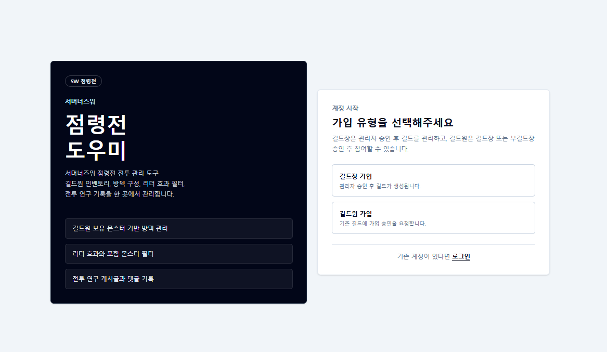

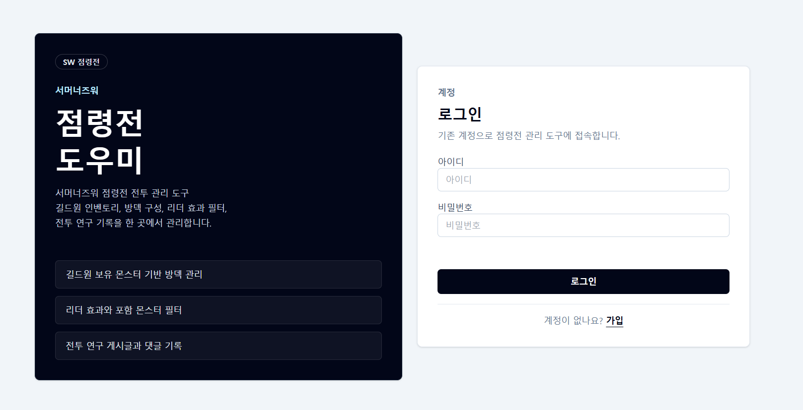

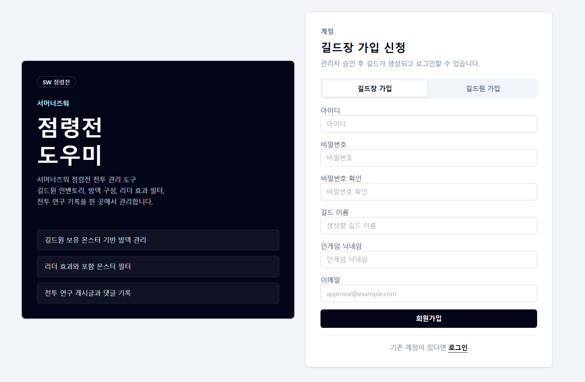

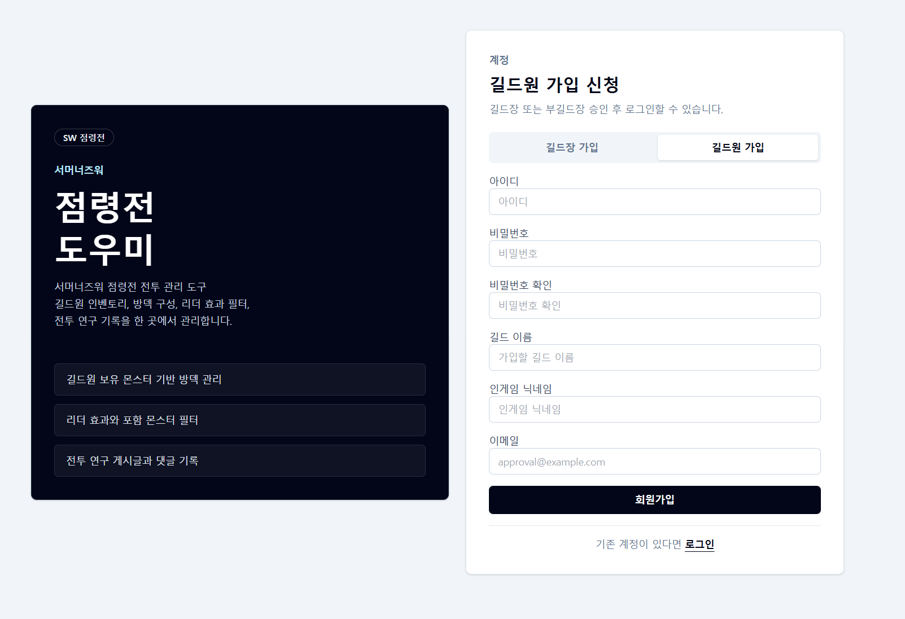

### 길드 운영

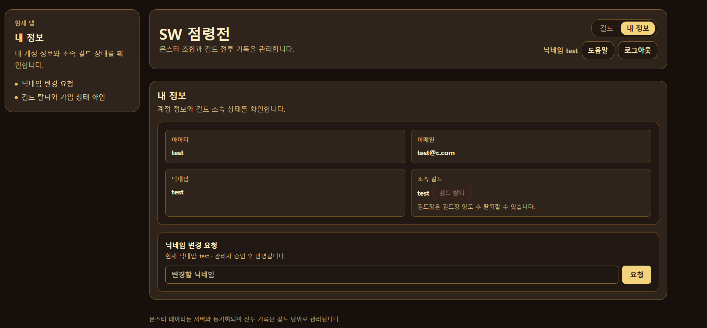

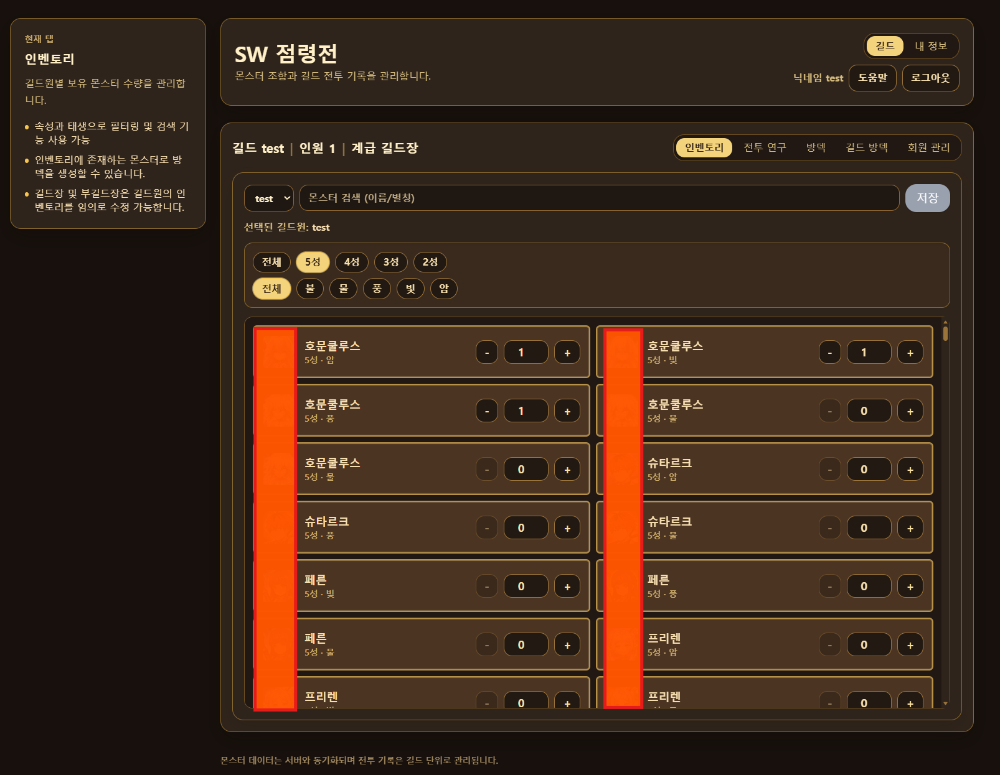

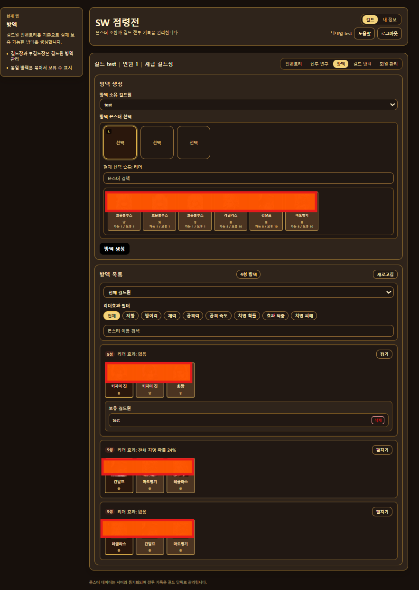

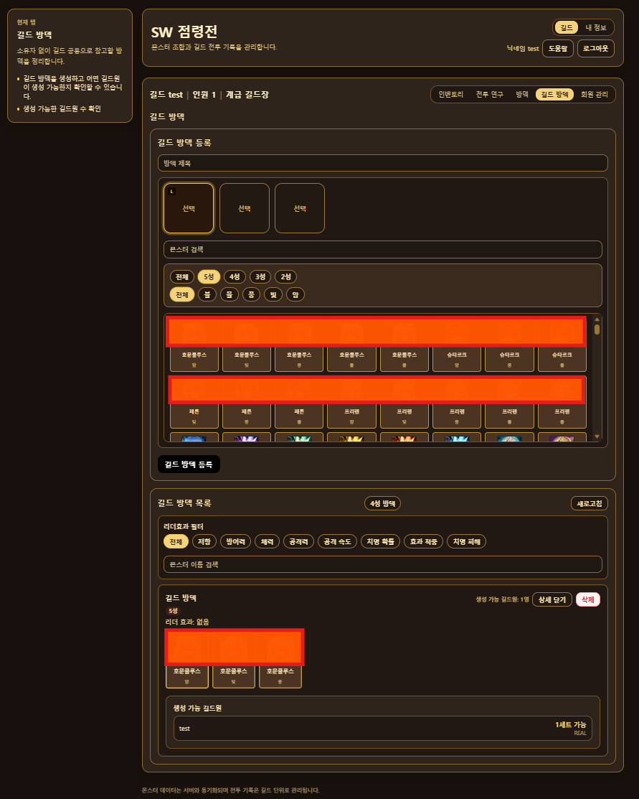

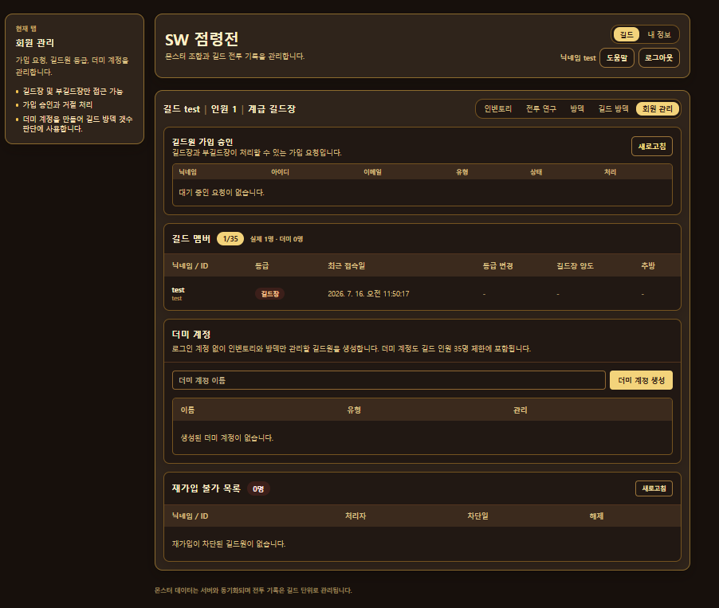

### 전투 연구 / 도움말

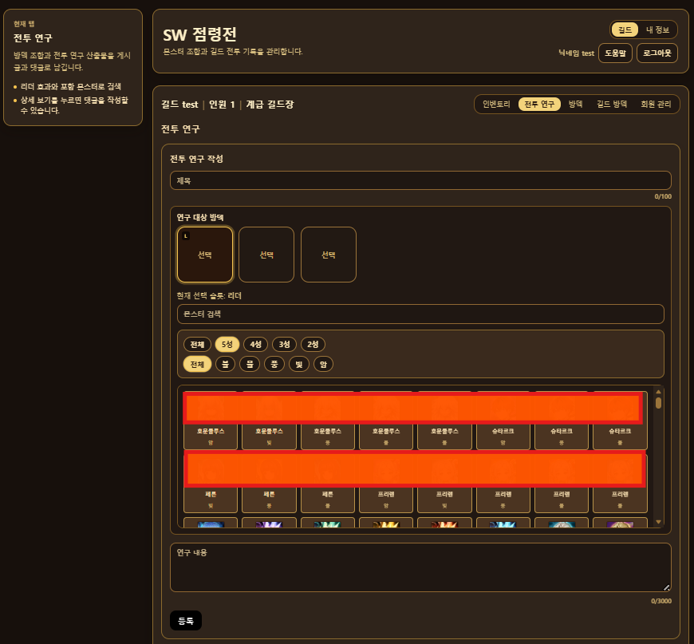

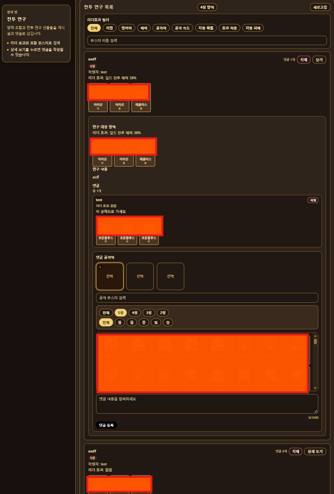

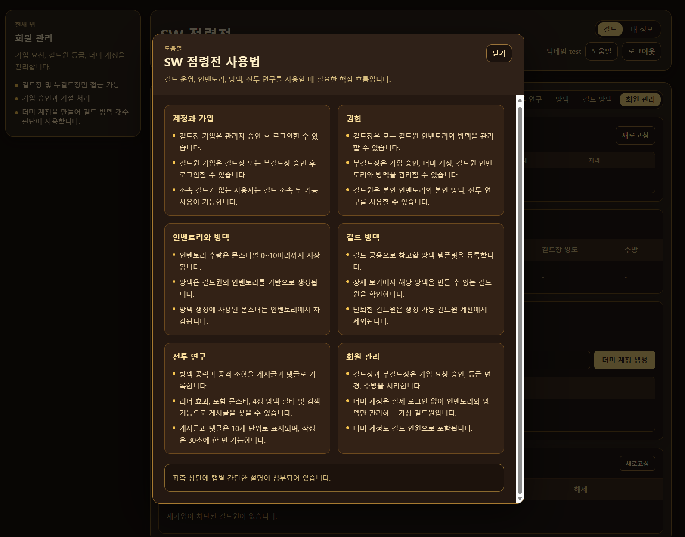


---

## 🚀 주요 기능

### 🔐 인증 / 사용자

- JWT 기반 로그인 인증
- Spring Security 기반 인증 처리
- Authorization Header 자동 처리
- 사용자 회원가입 / 로그인 / 내 정보 조회
- 길드장/길드원 가입 승인 흐름
- 승인 전 로그인 차단 및 승인 대기 안내 메시지
- 기존 계정의 길드 재가입 요청
- 닉네임 변경 요청 및 관리자 승인

---

### 🏰 길드 시스템

- 길드 생성
- 내 길드 조회
- 길드원 조회
- 길드 권한 관리
- 회원 관리 탭에서 등급 변경 / 추방 / 길드장 양도
- 회원 관리 탭에서 최근 접속일 표시 및 등급/접속일 기준 정렬
- 추방된 길드원의 재가입 차단 목록 관리
- 관리자 전용 길드 / 길드원 현황 조회
- 관리자 전용 현재 소속 길드 및 이력 조회

권한 구조:

| 권한 | 설명 |
|---|---|
| MASTER | 길드 전체 관리 |
| SUB_MASTER | 일부 운영 권한 |
| MEMBER | 일반 길드원 |

---

### 👾 몬스터 인벤토리 시스템

길드원별 몬스터 보유 수량 관리

- 몬스터 수량 등록/수정
- 보유 수량 기반 방덱 생성 가능 여부 계산
- 방덱 생성 시 몬스터 수량 차감
- 방덱 삭제 시 수량 복구
- `monsterCode` 기준 몬스터 식별
- 한글명/별칭 기반 몬스터 검색

---

### 🧩 몬스터 데이터 관리

- Swarfarm 외부 API 기반 몬스터 데이터 동기화
- 몬스터 이미지 파일은 저장소에 포함하지 않고 이미지 URL만 DB에 저장
- 몬스터 한글명, 별칭, 표시 여부 관리
- 2차 각성 우선 표시 및 미사용 몬스터 숨김 처리

---

### 🛡️ 방어 덱(방덱) 시스템

3마리 몬스터 기반 방어 덱 생성

- 리더 몬스터 개념 지원
- 리더 효과 기반 필터링
- 몬스터 포함 여부 필터
- 최대 3개 몬스터 동시 필터
- 4성 방덱 필터
- 길드원별 방덱 조회

---

### 🔍 방덱 검색 및 필터링

- 속성별 필터
- 몬스터 이름 검색
- 닉네임 검색
- 별칭 검색
- 한글명/별칭 검색
- 리더 효과 필터
- 몬스터 포함 필터
- 리더 우선 정렬

---

### 📚 전투 연구 V2

- 방덱과 공덱 조합을 독립적으로 등록
- 방덱·공덱 N:N 매치업 연결
- 매치업별 공략 작성과 삭제
- 몬스터 이름·별칭 검색과 4성 조합 필터
- 실제 점령전 로그의 사용 전적과 승률 연동
- 조합, 매치업, 사용 로그의 백엔드 페이지네이션

---

### 📊 점령전 로그 통계

- SWEX 플러그인 가공 JSON 업로드
- 파일·전투 단위 중복 방지
- 공덱·방덱 조합별 승률과 전적
- 공격자, 방어자, 소유자 및 길드별 상세 통계
- 전체·우리 길드·상대 길드 방덱 구분
- 포함 몬스터 검색과 4성 조합 필터
- 콜라보·오리지널 몬스터 통합 집계
- 업로드 로그 목록과 선택 삭제

통계의 게임 닉네임과 길드명은 사이트 회원 정보와 결합하지 않고 업로드 JSON의 스냅샷을 기준으로 집계합니다. 사이트 길드는 각 통계 데이터에 접근할 수 있는 보안 경계로만 사용합니다.

---

## 🛠️ 기술 스택

### Frontend

- React
- Vite
- Tailwind CSS
- Bootstrap Icons

---

### Backend

- Java 17
- Spring Boot 3
- Spring Security
- JPA (Hibernate)
- JWT Authentication
- Flyway
- Caffeine Cache
- Gradle

---

### Database

- H2 Database (dev)
- PostgreSQL / Neon (prod)

---

### Deployment

- Cloudflare Pages (Frontend)
- Render Singapore (Backend)
- Neon PostgreSQL Singapore (Database)
- Docker

```text
Cloudflare Pages -> Render Singapore -> Neon PostgreSQL Singapore
```

---

## Core Concepts

### 1) Monster
- 게임 내 몬스터 데이터
- 속성(불/물/풍/빛/암)
- 리더효과

### 2) Guild / GuildMember
- 길드 최대 인원: **35명**
- 길드원 유형:
  - `REAL`: 실제 로그인 유저 기반 길드원
  - `VIRTUAL`: 운영진이 임의로 추가하는 “인벤토리용 길드원”(길드원이 직접 가입하기 힘들 경우 사용)

### 3) Guild Roles & Permissions
- `MASTER`(길드 마스터): 모든 권한
  - 길드원 추방
  - 부마스터 임명(최대 5명)
  - 길드원 보유 몬스터(수량) 임의 수정
  - 길드원 방덱 구성/해체 가능
  - 주인 없는 방덱(템플릿) 생성/삭제 가능
- `SUB_MASTER`(부마스터): 마스터와 동일(단, 길드 해체 제외)
- `MEMBER`(일반 길드원):
  - 본인 인벤 입력 가능
  - 본인 보유 몬스터 범위 내에서 방덱 생성/삭제 가능
  - 전투 연구 게시글/댓글 작성 가능

---

## Defense Deck (방덱)

### 길드원 소유 방덱
- 방덱은 **몬스터 3마리**로 구성되며 순서가 중요합니다.
  - 0번 몬스터 = 리더
- 방덱 생성 시:
  - 길드원 인벤토리에서 해당 몬스터 수량이 각 1 이상이어야 함
  - 생성되면 각 몬스터 수량이 **-1 차감**
- 방덱 삭제 시:
  - 각 몬스터 수량이 **+1 복구**
- 필터링:
  - 특정 몬스터 포함 방덱만 보기
  - 리더효과 타입 필터
  - 길드원(소유자) 필터
  - 선택 몬스터가 **리더인 방덱 우선 정렬**
  - 몬스터 필터 + 리더효과 필터 **중첩 가능**

---

## Ownerless Defense Deck (주인 없는 방덱 템플릿)

운영진(마스터/부마스터)이 “길드 공용 방덱 템플릿”을 등록할 수 있습니다.

- 템플릿은 몬스터 3마리로 구성(0번 = 리더)
- 템플릿 상세 조회 시:
  - 해당 템플릿이 **가능한 길드원 목록**
  - **가능 인원 수(Count)** 자동 계산
- “가능” 기준:
  - 해당 길드원이 템플릿의 3마리 몬스터를 모두 **각 1개 이상 보유**하면 가능

> 운영 목적: “이 방덱이 나오는 사람이 길드에 몇 명인지”를 빠르게 파악하여  
> 방덱 채택/폐기 판단을 쉽게 합니다.

---

## Battle Research V2 (전투 연구)

길드 내에서 방덱과 공덱 조합을 중복 없이 관리하고, 두 조합의 매치업에 여러 공략을 기록합니다.

- `BattleResearchDefenseDeck`: 연구할 방덱 조합
- `BattleResearchAttackDeck`: 사용할 공덱 조합
- `BattleResearchMatchup`: 방덱과 공덱의 N:N 연결
- `BattleResearchGuide`: 특정 매치업의 공략

0번 몬스터는 리더 슬롯으로 보존하고 나머지 두 슬롯만 내부 중복 비교용으로 정렬합니다. 사용자 화면에는 입력한 몬스터 순서를 그대로 표시합니다.

점령전 로그에 동일한 공·방덱 조합이 존재하면 매치업 카드에서 실제 전적과 승률을 자동 조회합니다. 통계값은 연구 엔티티에 복사해 저장하지 않고 원본 로그를 기준으로 계산합니다.

### 삭제 정책

- 공략 삭제: 작성자 또는 길드장
- 조합 연결 삭제: 매치업과 공략만 삭제하고 공덱·방덱 조합은 보존
- 공덱 삭제: 연결된 매치업을 정리하되 방덱 조합은 보존
- 방덱 삭제: 연결된 매치업을 정리하되 공덱 조합은 보존

---

## API Response Format (Standard)

모든 API는 공통 응답 포맷을 사용합니다.

### Success
```json id="abc123d"
{
  "success": true,
  "data": {},
  "message": null
}
```

### Error
```json id="abc123d"
{
  "success": false,
  "data": null,
  "message": "에러 메시지"
}
```

---

## Run (Local)

### 0) Prerequisites

- Java 17
- Node.js 20 이상 권장
- H2는 로컬 파일 DB로 실행되며, DB 파일은 Git에 포함하지 않습니다.

### 1) Backend
```bash
cd Siege-Battle-Manager/backend/siege-backend
./gradlew bootRun
```

기본 서버 주소:

```text
http://localhost:8080
```

---

### 2) Frontend
```bash
cd Siege-Battle-Manager/frontend/siege-battle-manager
npm install
npm run dev
```

기본 프론트 주소:

```text
http://localhost:5173
```

---

### 3) Environment

로컬 실행 시 필요한 값은 `.env` 또는 실행 환경변수로 관리합니다.
실제 `.env` 파일은 Git에 커밋하지 않고, 예시 파일만 공개 저장소에 포함합니다.

```text
VITE_API_BASE_URL=http://localhost:8080
DB_URL=jdbc:h2:file:./data/siege-db
SWARFARM_BASE_URL=https://swarfarm.com/api/v2
SWARFARM_IMAGE_BASE_URL=https://swarfarm.com/static/herders/images/monsters
```

---

### 4) Monster Sync
최초 실행 후 관리자 기능에서 `몬스터 동기화` 후 `도감 정보 적용`을 실행합니다.

```text
POST /api/admin/monsters/sync-swarfarm
POST /api/admin/monsters/apply-localization
```

몬스터 한글명과 별칭은 아래 파일을 기준으로 관리합니다.

```text
Siege-Battle-Manager/backend/siege-backend/src/main/resources/data/monster-localization.json
```

신규 몬스터는 Swarfarm 동기화로 DB에 추가되며, 사용자 화면에는 로컬 관리 파일에서 한글명과 표시 여부를 관리한 뒤 노출합니다.

---

### 5) Local Test Flow

1. 회원가입/로그인
2. 길드 생성
3. 관리자 메뉴에서 몬스터 동기화 및 도감 정보 적용
4. 길드원 인벤토리 입력
5. 방덱 생성, 전투 연구 V2 조합·매치업·공략 작성 확인
6. SWEX JSON 업로드 후 통계 조회 확인

---

## 공개 저장소 관리 정책

- 게임 몬스터 이미지 파일은 GitHub 저장소에 포함하지 않습니다.
- 외부 API에서 제공되는 이미지 파일명으로 이미지 URL을 구성해 DB에 저장합니다.
- 로컬 H2 DB 파일, 개인 실행 데이터, `.env` 파일은 커밋하지 않습니다.
- 공개 저장소에는 예시 설정 파일과 소스 코드만 포함합니다.

---

## 주요 엔드포인트(요약)

- Auth/User

- POST /api/users/signup

- POST /api/users/login

- POST /api/users/me/nickname-change-requests

- GET /api/users/me/nickname-change-requests/pending

- DELETE /api/users/me/nickname-change-requests/pending

- Guild Approval / Member Management

- GET /api/guilds/me/join-requests

- POST /api/guilds/join-requests

- GET /api/guilds/join-requests/me

- DELETE /api/guilds/join-requests/me

- PATCH /api/guild-members/{guildMemberId}/role

- PATCH /api/guild-members/{guildMemberId}/transfer-master

- DELETE /api/guild-members/{guildMemberId}/real

- GET /api/guild-members/bans

- PATCH /api/guild-members/bans/{banId}/lift

- Admin Guild

- GET /api/admin/guilds

- GET /api/admin/guilds/{guildId}/members

- GET /api/admin/guilds/members/{guildMemberId}/history

- GET /api/admin/guilds/members/{guildMemberId}/nickname-histories

- Defense Deck

- POST /api/defense-decks/{guildMemberId}

- DELETE /api/defense-decks/{deckId}

- GET /api/defense-decks?monsterCode=&leaderEffect=&ownerMemberId=

- Monster Admin

- POST /api/admin/monsters/sync-swarfarm

- POST /api/admin/monsters/apply-localization

- GET /api/admin/monsters/localization

- PUT /api/admin/monsters/localization/{code}

- Ownerless Defense Deck (Template)

- POST /api/ownerless-defense-decks

- GET /api/ownerless-defense-decks/{deckId}

- DELETE /api/ownerless-defense-decks/{deckId}

- Battle Research V2

- POST /api/research/v2/defense-decks

- GET /api/research/v2/defense-decks

- POST /api/research/v2/attack-decks

- GET /api/research/v2/attack-decks

- POST /api/research/v2/matchups

- GET /api/research/v2/matchups

- POST /api/research/v2/matchups/{matchupId}/guides

- GET /api/research/v2/matchups/{matchupId}/usage-logs

- Siege Statistics

- POST /api/siege/log-imports

- GET /api/siege/log-imports

- DELETE /api/siege/log-imports/{importId}

- GET /api/statistics/summary

- GET /api/statistics/matches/attack-decks

- GET /api/statistics/matches/defense-decks

---

## Roadmap

- JWT 인증/회원 시스템

- 길드/길드원(REAL/VIRTUAL) + 권한 체계

- 몬스터/인벤토리(수량)

- 방덱 생성/삭제(인벤 차감/복구) + 필터링

- 주인 없는 방덱(템플릿) + 가능 인원 자동 계산

- 전투 연구 V2(방덱·공덱·매치업·공략) + 실제 사용 통계 연동

- SWEX JSON 기반 점령전 로그 통계와 로그 관리

- 성능 최적화(N+1 개선, count 쿼리 최적화)

- 프론트 연동(API 문서 상세화)

- 운영 배포 안정화(Render, Cloudflare Pages, Neon PostgreSQL)
- 저장소 분리와 보안 점검

- 베타 테스트와 운영 데이터 초기화

- 가입 알림·비밀번호 재설정 이메일 기능

---


## 💻 프로젝트의 철학

> 이 프로젝트는 게임을 하다 불편한 점을 개선하기 위해 시작되었다.

> 주 목적은 길드 전체 방덱 구성을 손쉽게 할 수 있게 하고

> 모든 길드원이 같은 방덱에 효율적인 공덱으로 공격을 할 수 있게 하며

> 전략 연구 자료를 축적하는 데이터베이스 역할을 한다.

> 즉, 점령전 운영을 서포트하는 길드 매니지먼트 플랫폼이다.

---

## 📂 프로젝트 구조

```text
frontend/
 ├─ components/
 ├─ tabs/
 ├─ lib/
 └─ data/

backend/
 ├─ domain/
 ├─ repository/
 ├─ service/
 ├─ controller/
 ├─ dto/
 └─ security/

```

---

## 📄 Documents

 | 문서                                             | 설명          |
| ---------------------------------------------- | ----------- |
| [RoadMap](./docs/RoadMap.md)                        | 프로젝트 진행 현황  |
| [Backend Docs](./docs/BACKEND.md)              | 백엔드 구조 및 설계 |
| [API Docs](./docs/API.md)                      | API 명세      |
| [ERD](./docs/ERD.md)                           | 데이터베이스 구조   |
| [Test Scenario](./docs/TEST_SCENARIO.md)       | 로컬 테스트 흐름   |
| [Trouble Shooting](./docs/TROUBLE_SHOOTING.md) | 문제 해결 과정 정리 |
| [User Guide](./docs/USER_GUIDE.md)             | 사용자 이용 가이드 |
| [Daily Log 2026-07-13](./docs/DAILY_LOG_2026-07-13.md) | 2026-07-13 작업 기록 |
